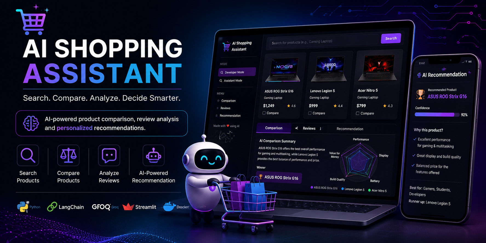
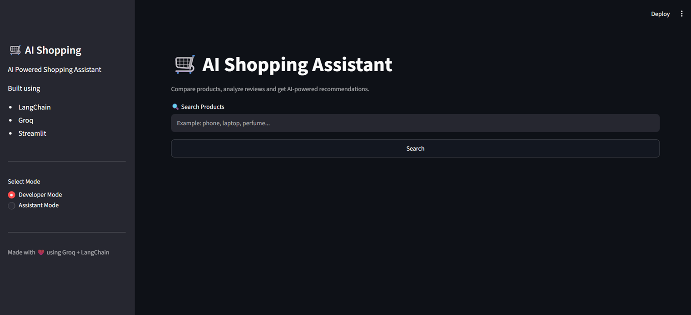
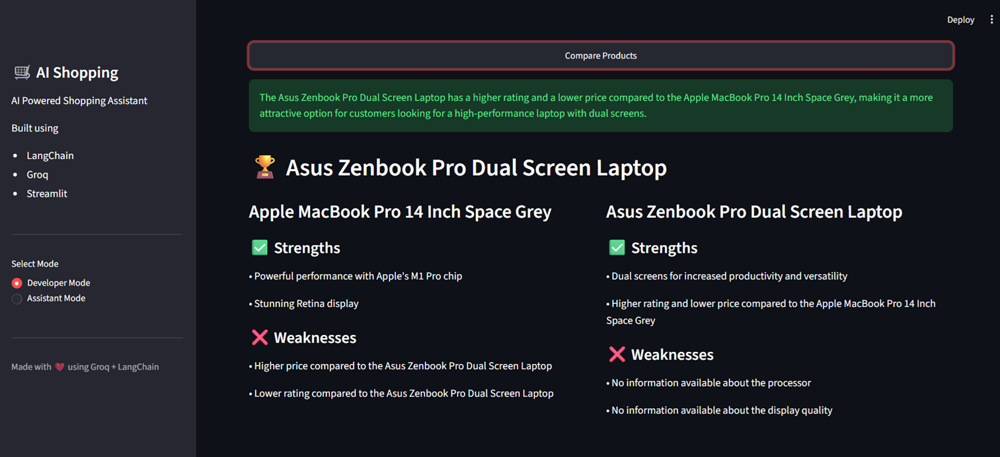
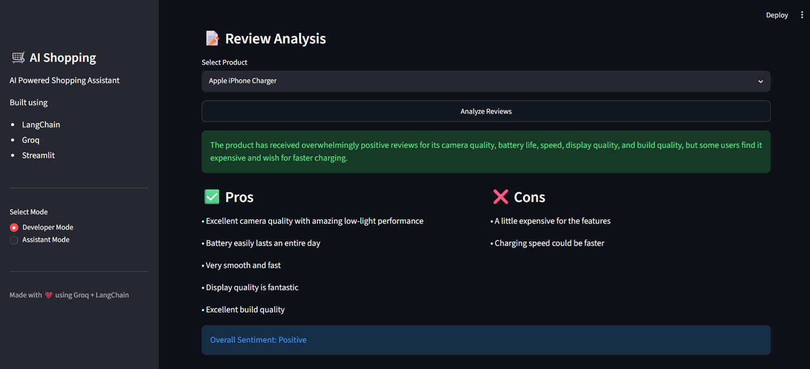
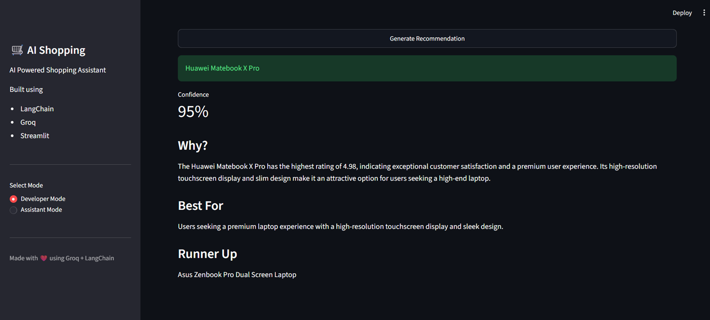

# 🛒 AI Shopping Assistant

<p align="center">
  
</p>

<p align="center">


</p>

<p align="center">
<b>AI-powered shopping assistant that compares products, analyzes customer reviews, and delivers personalized recommendations using Groq, LangChain, and Streamlit.</b>
</p>

<p align="center">

### 🚀 Live Demo

**https://shopping-assistant-ai.streamlit.app/**

</p>

---

# ✨ Features

* 🔍 Search products from a product API
* ⚖️ AI-powered product comparison
* 📝 AI review summarization
* ✅ Automatic Pros & Cons extraction
* 📊 Sentiment analysis
* 🤖 Personalized product recommendations
* 🧠 End-to-end AI shopping pipeline
* 🎨 Professional Streamlit interface
* 🐳 Dockerized for easy deployment

---

# 🎬 Demo GIF

<p align="center">
  
</p>

---

# 📸 Screenshots

| Home                 | Product Comparison         |
| -------------------- | -------------------------- |
|  |  |

| Review Analysis        | AI Recommendation              |
| ---------------------- | ------------------------------ |
|  |  |

---

# 🏗️ Architecture

```text
                           User

                             │

                             ▼

                     Streamlit UI

                             │

                             ▼

                shopping_pipeline.py

        ┌──────────────┼──────────────┐
        ▼              ▼              ▼

 Product Search   Review Analysis   Product Comparison

        └──────────────┼──────────────┘
                       ▼

          Recommendation Engine

                       ▼

               Groq LLM (LangChain)
```

---

# ⚡ Workflow

```text
Search Product
        │
        ▼
Fetch Products
        │
        ▼
Analyze Reviews
        │
        ▼
Compare Products
        │
        ▼
Generate Recommendation
        │
        ▼
Display Best Product
```

---

# 🧠 Tech Stack

| Category           | Technology        |
| ------------------ | ----------------- |
| Language           | Python 3.11       |
| LLM                | Groq              |
| Framework          | LangChain         |
| Frontend           | Streamlit         |
| Containerization   | Docker            |
| Prompt Engineering | LangChain Prompts |
| Data Format        | JSON              |

---

# 📂 Project Structure

```text
ai-shopping-assistant/

│── app.py
│── config.py
│── llm.py
│── chains.py
│── prompts.py
│── requirements.txt
│── Dockerfile
│── .dockerignore
│── .env.example
│── LICENSE
│── README.md
│
├── assets/
│   ├── banner.png
│   ├── demo.gif
│   ├── home.png
│   ├── comparison.png
│   ├── review.png
│   └── recommendation.png
│
├── services/
│   ├── product_search.py
│   ├── product_compare.py
│   ├── review_summarizer.py
│   ├── recommendation.py
│   └── shopping_pipeline.py
│
├── ui/
│   ├── sidebar.py
│   ├── product_card.py
│   ├── comparison_tab.py
│   ├── review_tab.py
│   ├── recommendation_tab.py
│   └── assistant_mode.py
│
└── data/
    └── reviews.json
```

---

# 🚀 Getting Started

## 1. Clone the Repository

```bash
git clone https://github.com/akashbharangar/ai-shopping-assistant.git

cd ai-shopping-assistant
```

---

## 2. Create a Virtual Environment

### Windows

```bash
python -m venv venv

venv\Scripts\activate
```

### Linux / macOS

```bash
python3 -m venv venv

source venv/bin/activate
```

---

## 3. Install Dependencies

```bash
pip install -r requirements.txt
```

---

## 4. Configure Environment Variables

Create a `.env` file from `.env.example`.

```env
GROQ_API_KEY=your_groq_api_key
MODEL_NAME=llama-3.3-70b-versatile
```

---

## 5. Run the Application

```bash
streamlit run app.py
```

Visit:

```text
http://localhost:8501
```

---

# 🐳 Docker

### Build the Docker Image

```bash
docker build -t ai-shopping-assistant .
```

### Run the Container

```bash
docker run -p 8501:8501 --env-file .env ai-shopping-assistant
```

Then open:

```text
http://localhost:8501
```

---

# 🌍 Deployment

The application is deployed on **Streamlit Community Cloud**.

### Live Demo

**https://shopping-assistant-ai.streamlit.app/**

---

# 📌 Example Use Case

A user wants to buy a gaming laptop.

The assistant:

* Searches relevant products
* Analyzes customer reviews
* Extracts key pros and cons
* Compares multiple products
* Generates a personalized recommendation

All powered by a Large Language Model.

---

# 💡 Skills Demonstrated

* Generative AI
* Large Language Models (LLMs)
* LangChain
* Groq API Integration
* Prompt Engineering
* AI Workflow Orchestration
* Product Recommendation Systems
* Customer Review Analysis
* Structured JSON Outputs
* Streamlit Application Development
* Docker
* Python Project Architecture

---

# 🔮 Future Scope

* Integration with real e-commerce APIs
* Multi-vendor product search
* Authentication
* Wishlist support
* Purchase history
* Multi-language support

---

# 🤝 Contributing

Contributions are welcome!

1. Fork the repository
2. Create a new branch
3. Commit your changes
4. Push the branch
5. Open a Pull Request

---

# 📜 License

This project is licensed under the **MIT License**.

See the **LICENSE** file for more information.

---

# 👨‍💻 Author

## Akash Bharangar

**AI Engineer | GenAI Engineer**

* GitHub: https://github.com/akashbharangar
* LinkedIn: https://www.linkedin.com/in/akash-bharangar-757440186/

---

<p align="center">
⭐ If you found this project useful, consider giving it a star!
</p>
